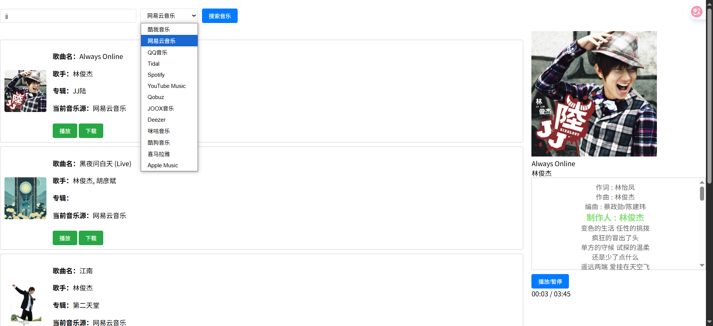

# 🎵 多源音乐搜索播放器

一个支持多个音乐平台的搜索、播放和下载工具，带有实时歌词滚动功能。基于 [GDStudio](https://music-api.gdstudio.xyz) 提供的音乐 API 服务开发。（学习项目，UI一坨，但是功能好使）

## 界面

## ✨ 特性

- 🔍 **多平台搜索**：支持 13 个音乐平台(有的不好用)
- 🎵 **在线播放**：流畅的音频播放体验
- 📝 **歌词同步**：实时滚动高亮显示当前歌词
- 💾 **音乐下载**：支持将喜欢的音乐下载到本地
- 🖼️ **专辑封面**：显示高清专辑封面
- 🎨 **响应式布局**：搜索结果和播放器并列显示

## 🎼 支持的音乐平台

酷我音乐 · 网易云音乐 · QQ音乐 · Spotify · Apple Music · YouTube Music · Tidal · Qobuz · JOOX · Deezer · 咪咕音乐 · 酷狗音乐 · 喜马拉雅

## 🚀 快速开始

### 前置要求

- Node.js (v12 或更高版本)

### 启动步骤

1. 启动代理服务器

   > node proxy.js

2. 在浏览器访问 `http://localhost:9000`

### 默认端口

默认端口为 `9000`，可通过环境变量 `PORT` 修改

## 📁 项目结构

- `music.html` - 前端界面（搜索、播放、歌词显示）
- `proxy.js` - Node.js 代理服务器
- `README.md` - 项目说明文档

## 💡 使用方法

1. **搜索音乐**：输入歌曲名/歌手名，选择平台，点击搜索
2. **播放音乐**：点击搜索结果中的"播放"按钮
3. **下载音乐**：点击"下载"按钮保存到本地

## 🔍 技术说明

### 为什么酷我音乐需要代理？

1. **HTTP/HTTPS 混合内容** - 酷我使用 HTTP 协议，浏览器会阻止 HTTPS 页面加载 HTTP 资源
2. **防盗链机制** - 需要特定的 Referer 和 User-Agent 请求头
3. **CORS 跨域限制** - 酷我服务器不支持跨域访问
4. **Range 请求支持** - 支持音频拖动和断点续传

### 代理服务器功能

- 静态文件服务
- 酷我音乐音频代理
- API 请求转发
- CORS 头处理

## 🎨 界面布局

- **左侧**：搜索框和搜索结果列表
- **右侧**：专辑封面、歌曲信息、实时歌词、播放控制

## 🔧 API 服务

**API 提供方：** [GDStudio](https://music-api.gdstudio.xyz)

> 💖 **特别感谢**：感谢 GDStudio 团队提供的免费音乐 API 服务，让这个项目得以实现。这个 API 聚合了多个音乐平台的数据，为开发者提供了便捷的音乐搜索和播放功能。

## ⚠️ 注意事项

- 需要稳定的网络连接
- 请尊重音乐版权，仅供个人学习使用
- 推荐使用现代浏览器（Chrome、Firefox、Edge）

## 🐛 常见问题

**Q: 播放失败怎么办？**  
A: 检查代理服务器是否运行，尝试切换其他音乐平台

**Q: 歌词不显示？**  
A: 部分歌曲可能没有歌词数据

**Q: 下载功能不可用？**  
A: 检查浏览器下载设置和权限

## 🙏 致谢

- **API 提供方**：感谢 [GDStudio](https://music-api.gdstudio.xyz) 提供的音乐 API 服务
- **音乐平台**：感谢所有音乐平台提供的优质音乐内容
- **开源社区**：感谢所有为本项目提供建议和反馈的开发者

## 📄 许可证

本项目仅供学习交流使用，请勿用于商业用途。

---

⭐ 如果这个项目对你有帮助，欢迎 Star！